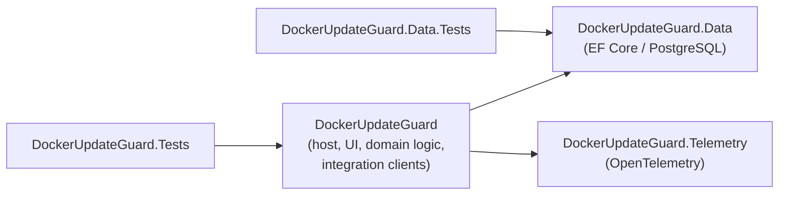
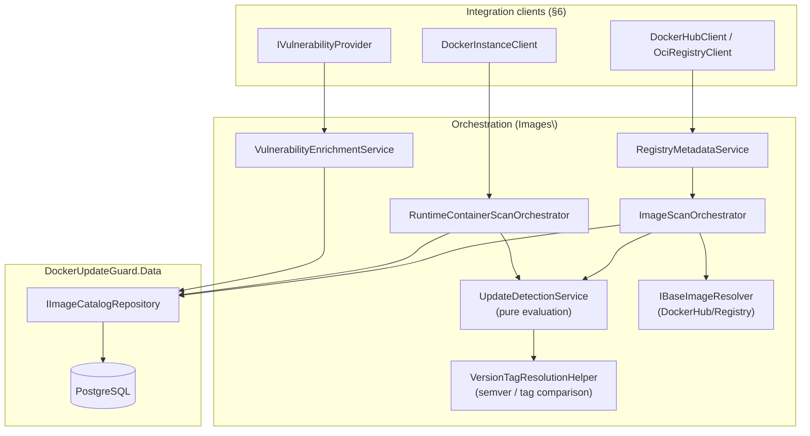

# Architecture

This document describes the architecture of DockerUpdateGuard as currently
implemented. It is a technical reference for contributors and AI coding
agents working in this repository; it complements, and does not repeat,
[README.md](README.md) (product scope, configuration reference), the
[docs/](docs) folder (contribution, testing, deployment tiers), and
[CLAUDE.md](CLAUDE.md) / [AGENTS.md](AGENTS.md) /
[.github/copilot-instructions.md](.github/copilot-instructions.md) (coding
conventions).

## 1. Purpose and shape of the system

DockerUpdateGuard is a single-process ASP.NET Core web application that:

1. discovers Docker Engine instances and the containers running on them,
2. correlates what is running with registry tag/digest data to detect
   available or needed updates,
3. resolves base-image relationships and reuse across observed images,
4. enriches images with vulnerability data (Trivy or Docker Scout),
5. records the results of all of the above as history in PostgreSQL, and
6. serves a Blazor Server UI over that data.

There is no separate API tier, message queue, or worker process — scanning,
persistence, and UI all run inside one ASP.NET Core host, coordinated
in-process via `IHostedService` background jobs and a shared PostgreSQL
database. This keeps deployment to a single container plus PostgreSQL (see
§10), at the cost of the background scan engine and the UI sharing the same
process and connection pool.

## 2. Solution layout

```
DockerUpdateGuard.slnx
├── src\DockerUpdateGuard              # ASP.NET Core host (Microsoft.NET.Sdk.Web) — composition root
├── src\DockerUpdateGuard.Data         # EF Core / PostgreSQL persistence layer
├── src\DockerUpdateGuard.Telemetry    # OpenTelemetry hosting/export layer
└── src\Tests
    ├── DockerUpdateGuard.Tests        # Host/UI/domain tests (MSTest, NSubstitute, bUnit, EF InMemory)
    └── DockerUpdateGuard.Data.Tests   # Data-layer tests (MSTest, EF Core against real SQLite)
```



`DockerUpdateGuard.Data` and `DockerUpdateGuard.Telemetry` do not reference
the host project or each other. Web startup, DI wiring, background jobs,
integration clients, domain/scan logic, and the Blazor UI all live in the
host project — there is intentionally no separate "Application"/"Domain"
assembly; the boundary that matters in this codebase is persistence vs.
observability vs. everything else. Persistence stays in `.Data`;
observability stays in `.Telemetry`; the host project owns composition.

Solution-wide conventions (`.slnx` format, `net10.0`, nullable/implicit
usings, `SharedAssemblyInfo.cs`, per-configuration rulesets, centralized
`GlobalSuppressions.cs`, `Reihitsu.Analyzer` + `SonarAnalyzer.CSharp`) are
documented in [CLAUDE.md](CLAUDE.md) and not repeated here.

## 3. Host composition and startup sequence

`src\DockerUpdateGuard\Program.cs` is intentionally thin. It delegates DI
registration to `ServiceCollectionExtensions.AddDockerUpdateGuardHost`, the
composition root, which in order:

1. Binds and validates `DockerUpdateGuardOptions` (`.ValidateOnStart()` —
   the host fails fast on invalid configuration before it accepts traffic).
2. Resolves the PostgreSQL connection string
   (`DockerUpdateGuardConnectionStringResolver`) and registers the EF Core
   context via `DockerUpdateGuard.Data`'s `AddDockerUpdateGuardData`, with
   `EnableRetryOnFailure` driven by `DatabaseOptions`.
3. Registers OpenTelemetry via `DockerUpdateGuard.Telemetry`'s
   `AddDockerUpdateGuardTelemetry`.
4. Registers `TransientHttpRetryHandler` as the outbound message handler
   for every named `HttpClient` (Docker Hub, generic OCI registry,
   .NET/nginx release metadata, Portainer).
5. Registers the integration clients, domain/orchestration services, the
   UI facade (`IApplicationViewService`), and all 7 background jobs
   (`AddHostedService<T>()`) — see §6 and §7.

`Program.cs` then adds MudBlazor (`AddMudServices()`) and Razor Components
with **Interactive Server** rendering (`AddInteractiveServerComponents()` /
`AddInteractiveServerRenderMode()`) — Blazor Server only, no WebAssembly or
Auto render mode anywhere in the app.

After `WebApplication.Build()` and before `RunAsync()`, the host calls
`ApplicationInitializationExtensions.InitializeDockerUpdateGuardAsync`,
which blocks startup on:

1. `DatabaseMigrator.MigrateAsync` — waits for the database to become
   reachable (retrying transient connection failures), then, on PostgreSQL,
   takes a session-scoped **advisory lock**
   (`pg_advisory_lock(5410320540103205)`) before running EF Core migrations
   and releases it in a `finally`. This serializes `dotnet ef`-style
   migrations across multiple instances of the app starting concurrently
   against the same database (e.g. a rolling deployment), so only one
   instance applies migrations while the others wait.
2. `IInstanceDiscoveryService.SynchronizeConfiguredInstancesAsync` —
   reconciles configured `DockerInstanceOptions` against the DB. This is
   local, DB-only work and is awaited synchronously.
3. `ApplicationTelemetry.RefreshInventoryMetricsAsync` — seeds the
   observable gauges (§9) with current counts.

Docker Hub account discovery (`DockerHubAccountImageDiscoveryService`) is
**deliberately not** part of this blocking sequence, because it makes
sequential per-repository network calls — it instead runs as the first
iteration of `DockerHubAccountImageDiscoveryBackgroundService` immediately
after the host starts accepting traffic, so a slow or unreachable Docker
Hub does not delay application startup.

The middleware pipeline (non-Development only where noted) is:
`UseExceptionHandler("/error")` → `UseHsts()` → `UseHttpsRedirection()`
(Production only) → `UseStatusCodePagesWithReExecute("/not-found")` →
`UseAntiforgery()` → `MapStaticAssets()` →
`MapRazorComponents<App>().AddInteractiveServerRenderMode()`. There is no
authentication, authorization, health-check, or rate-limiting middleware —
see §11 for the resulting security posture.

## 4. Configuration model

Configuration is bound from the `DockerUpdateGuard` and `Telemetry` sections
via standard ASP.NET Core configuration (files, command-line, secret
stores). The full key-by-key reference (defaults, valid ranges, required
combinations) lives in [README.md](README.md#configuration-reference) and
is not duplicated here.

Architecturally relevant points:

- Every options class (`DockerUpdateGuardOptions` and its nested
  `Database`/`DockerHub`/`ReleaseMetadata`/`Vulnerabilities`/`Scanning`/
  `DockerInstances[]`/`Portainer` sections, plus `TelemetryOptions`) has a
  matching `IValidateOptions<T>` validator wired with `.ValidateOnStart()`,
  so misconfiguration is a startup failure, not a runtime surprise.
- `ScanningOptions` and `DockerHubOptions` are read live through
  `IOptionsMonitor<DockerUpdateGuardOptions>` by the background jobs and
  `TransientHttpRetryHandler`, so interval/retry/parallelism changes in
  `appsettings.json` take effect without a restart (a config *reload*, not
  a live-edit UI).
- `DockerUpdateGuardConnectionStringResolver` prefers an inline
  `DockerUpdateGuard:ConnectionString` over the named `ConnectionStrings`
  entry, and is used identically by both the DI registration and the
  validator so the two can never disagree about which connection string is
  active.

## 5. Data layer (`DockerUpdateGuard.Data`)

EF Core over PostgreSQL (`Npgsql.EntityFrameworkCore.PostgreSQL`).
`DockerUpdateGuardDbContext` exposes 15 `DbSet<T>`; entity configuration
uses one `IEntityTypeConfiguration<T>` per entity under `Configurations\`,
auto-discovered via `ApplyConfigurationsFromAssembly`.

### 5.1 Entity model

| Entity | Role |
| --- | --- |
| `RegistryRepository` | Normalized `(Registry, Repository)` pair; parent of all `ImageVersion` rows for that repository. |
| `ImageVersion` | Normalized, deduplicated `(repository, tag, digest)` node — the central catalog entity; carries a vulnerability-assessment rollup. |
| `ImageRelationship` | Edge from a child `ImageVersion` to its base `ImageVersion` (`BaseImage`/`BuildStage`), with `Depth` — the base-image dependency graph. |
| `ObservedImage` | A user/discovery-registered "track this image" target; points at a `CurrentImageVersion`. |
| `DockerInstance` | A configured Docker Engine endpoint; optionally has one `PortainerEndpoint`. |
| `PortainerEndpoint` | Portainer connection details for a `DockerInstance`. |
| `ContainerSnapshot` | A discovered/running container at a point in time, with its resolved `UpdateAssessmentStatus`. |
| `ScanRun` | A persisted scan execution (type/status/trigger), optionally scoped to an `ObservedImage` or `DockerInstance`. |
| `UpdateFinding` | A detected update (subject `ImageVersion` → optional recommended `ImageVersion`), linked to an `ObservedImage` and/or `ContainerSnapshot`. |
| `TagCandidate` | One ranked candidate tag belonging to an `UpdateFinding`. |
| `VulnerabilityFinding` | A CVE/advisory against an `ImageVersion` (severity, fix status, CVSS). |
| `ContainerActionRun` | A requested Portainer action (restart/redeploy/update) against a container, service, or stack. |
| `RuntimeContainerTagSelection` | A manually pinned tag/digest override for a specific runtime container. |
| `DockerInstanceResourceSample` / `RuntimeContainerResourceSample` | Instance-level and per-container CPU/memory/network time series. |

Every enum used by these entities lives alongside them in the `Entities`
namespace (the dedicated `Enums\` folder is present but unused).

### 5.2 Repositories vs. Queries

The `Repositories\` and `Queries\` folders are deliberately split by
read/write intent, not by entity:

- **`Repositories\` — `IImageCatalogRepository`.** The single write-side
  aggregate root for the `RegistryRepository`/`ImageVersion` catalog. Its
  `GetOrCreateImageVersionAsync`/`GetOrCreateRegistryRepositoryAsync`
  methods enforce catalog uniqueness (including a `DbUpdateException`
  race-retry path for concurrent get-or-create calls under load) so
  scanners never create duplicate catalog rows. This is the only
  repository in the project — no entity outside the catalog needed one.
- **`Queries\` — `ILiveImageInventoryQueryService`,
  `ISharedBaseImageQueryService`.** Read-only, multi-entity, page-shaped
  projections (joins/grouping across `ImageVersion`, `ImageRelationship`,
  `ObservedImage`, `ContainerSnapshot`) that return plain DTOs instead of
  tracked entities, and don't naturally belong to any single entity's
  repository. `ILiveImageInventoryQueryService.GetLiveImageVersionIdsAsync`
  in particular is the shared definition of "still relevant" used by
  `ScanCleanupBackgroundService` (§7) to decide what history to keep.

### 5.3 Migrations

Current migrations, in order: `InitialCreate` → `Update1` → … → `Update7`
(latest). New migrations follow the `Update{N}` naming convention described
in [CLAUDE.md](CLAUDE.md#ef-core-migrations); `Design\
DockerUpdateGuardDbContextFactory` provides the design-time `DbContext` for
`dotnet ef` tooling.

## 6. Integration clients

Each external system has one hand-written client behind a narrow interface
— there is no dependency on `Docker.DotNet`, a Portainer SDK, or a Trivy
client library. All clients return plain DTOs wrapped in
`ExternalOperationResult<T>` (`Infrastructure\ExternalOperationResult{T}.cs`)
rather than throwing for expected failure modes (`NotConfigured`,
`Unsupported`, `NotFound`, `Failed`, `Unknown`); orchestrators branch on
that status instead of on exceptions.

| Client | Talks to | Notes |
| --- | --- | --- |
| `DockerInstanceClient` (`Docker\`) | Docker Engine HTTP API (`v1.41`) | One HTTP transport supporting `http(s)://`, `tcp://`, `unix://` (via `SocketsHttpHandler.ConnectCallback`), and `npipe://` (Windows named pipes) behind a single client, pooled per connection config. |
| `DockerHubClient` (`DockerHub\`) | Docker Hub REST API **and** the OCI Distribution v2 API (`registry-1.docker.io`) | Implements both `IDockerHubClient` (repository/tag metadata) and the generic `IRegistryMetadataClient` (manifest/blob/base-image-label resolution), because Docker Hub is both a metadata API and an OCI registry. |
| `OciRegistryClient` (`Images\`) | Any OCI Distribution v2 registry | The registry-agnostic counterpart to `DockerHubClient`'s registry half, for non-Docker-Hub registries. |
| `PortainerClient` (`Portainer\`) | Portainer REST API | JWT login, then endpoint/container listing and action execution (restart/redeploy/update) behind `IPortainerClient`. |
| `TrivyVulnerabilityProvider` (`Vulnerabilities\`) | Trivy CLI (external process), client mode against a Trivy server | Runs `trivy image --server <url> --format json …` via `IProcessRunner`/`ProcessRunner`, parses stdout JSON. The `trivy` binary ships inside the container image (see §10). |
| `DockerScoutVulnerabilityProvider` (`Vulnerabilities\`) | Docker Scout / Docker Hub HTTP API | Docker Hub login → cached bearer token → paginated vulnerability fetch (capped at 50 pages). |
| `DefaultVulnerabilityProvider` (`Vulnerabilities\`) | — | No-op fallback when vulnerability scanning is disabled/unconfigured (`IVulnerabilityProviderResolver` selects it). |

`RegistryMetadataService` is the dispatcher in front of
`IRegistryMetadataClient`: it holds every registered client and picks the
first whose `CanHandle(registry)` matches, falling back to
`NullRegistryMetadataClient` (an `Unsupported` sentinel) for registries
nothing can handle — adding a new registry type means adding one more
`IRegistryMetadataClient` implementation, not touching the dispatcher.

`TransientHttpRetryHandler` (`Infrastructure\`) is attached to every
outbound `HttpClient` (Docker Hub, OCI registry, release-metadata feeds,
Portainer) and retries transient failures (408/429/5xx,
`HttpRequestException`, `TimeoutException`) honoring `Retry-After`,
otherwise exponential backoff with jitter, up to `ScanningOptions.RetryCount`.

## 7. Domain / orchestration layer and the scan engine

`src\DockerUpdateGuard\Images` is the largest folder in the project and is
where integration-client DTOs turn into persisted findings. Clients never
touch `DockerUpdateGuardDbContext` directly; orchestrators do:



- **`IUpdateDetectionService` (`UpdateDetectionService`)** is a pure
  evaluator (`Evaluate(ImageReference, tags) -> UpdateEvaluationResult`,
  no I/O), so update logic can be unit-tested without mocking HTTP or the
  database.
- **`VersionTagResolutionHelper`** is the tag-comparison engine: parses
  `major.minor.patch[-suffix]` and `YYYY-suffix` (year-prefixed) tags,
  groups tags into "variant families" (e.g. `-alpine`, `-jammy`) so an
  Alpine tag is never recommended as an update for a Debian one, resolves
  floating alias tags (`latest`) back to the concrete semver tag sharing
  their digest, and ranks pre-release identifiers below GA releases.
- **Major-version upgrades are deliberately conservative.** A new major
  line is only surfaced as an actionable update once it has at least
  `Scanning:MajorUpgradeMinimumReleaseCount` releases, its first (`x.0.0`)
  release is older than `Scanning:MajorUpgradeMinimumAgeDays`, and the
  current major line has gone dormant. Until then it is shown only as
  descriptive text on an otherwise `UpToDate` result — this avoids
  recommending a major upgrade the day it ships. Both thresholds accept
  `0` to disable the corresponding wait.
- **`IDerivedBaseRuntimeDetector`** infers a locally running .NET/nginx
  runtime version from Docker inspect environment variables and image
  history alone (no registry call), which `IDotNetReleaseMetadataService`/
  `INginxReleaseMetadataService` then compare against upstream release
  feeds — this covers images that don't expose a useful base-image label,
  at the cost of only recognizing the two runtimes it has explicit
  detection rules for.
- **`ImageScanOrchestrator`** guards against overlapping scans of the same
  observed image with a static per-image `SemaphoreSlim` registry
  (`ObservedImageScanLockEntry`), not a database lock — this is a
  same-process concurrency guard, not a multi-instance one (see §11 for
  the deployment assumption this relies on).
- Orchestrators write directly to `DbContext` sets (`UpdateFindings`,
  `ImageRelationships`, `ScanRuns`) for their own aggregates, and go
  through `IImageCatalogRepository` only for the shared, dedup-sensitive
  `RegistryRepository`/`ImageVersion` catalog.

## 8. Background job engine

All seven scheduled jobs derive from `ScheduledBackgroundService`
(`Images\ScheduledBackgroundService.cs`), a template-method
`BackgroundService`: subclasses supply `GetInterval()` and
`ExecuteCoreAsync`, optionally `ExecuteStartupAsync` (runs once before the
loop) and override `ShouldExecuteImmediately()` (default `true`). The base
class re-evaluates `GetInterval()` every iteration (so config-reload
changes apply live), creates a DI scope per run, and catches/logs
exceptions from `ExecuteCoreAsync` so one failing run never crashes the
host.

| Job | Does | Interval source |
| --- | --- | --- |
| `DockerInstanceDiscoveryBackgroundService` | Reconciles configured `DockerInstanceOptions` against the DB. | `Scanning:DiscoveryIntervalMinutes` |
| `DockerHubAccountImageDiscoveryBackgroundService` | Discovers repositories/images under the configured Docker Hub account. Runs immediately at startup (§3). | `Scanning:DockerHubAccountDiscoveryIntervalMinutes` |
| `OwnImageBaseRefreshBackgroundService` | Scans all enabled observed images for base-image/tag updates (`ImageScanOrchestrator.ScanAllAsync`). | **Dynamic** — see below |
| `RuntimeContainerRefreshBackgroundService` | Scans running containers for update opportunities (`RuntimeContainerScanOrchestrator.ScanAllAsync`). | `Scanning:RuntimeImageUpdateScanIntervalMinutes` |
| `ResourceStatisticsRefreshBackgroundService` | Samples Docker instance/container CPU/memory/network usage. | `Scanning:ResourceStatisticsIntervalMinutes` |
| `VulnerabilityRefreshBackgroundService` | Refreshes CVE findings via the resolved `IVulnerabilityProvider`. | `Scanning:VulnerabilityRefreshIntervalMinutes` |
| `ScanCleanupBackgroundService` | Repairs stale `Running` scan rows on startup, then purges history past retention (see below). | `Scanning:CleanupIntervalMinutes` |

**Dynamic own-image scan interval.** Unlike the other jobs,
`OwnImageBaseRefreshBackgroundService.GetInterval()` computes its interval
per iteration via `ObservedImageScanIntervalCalculator`:
`max(OwnImageBaseScanIntervalMinutes, ⌈(DockerHubRequestLimitWindowHours ×
60 × enabledObservedImageCount) / (DockerHubRequestLimitPerWindow −
DockerHubReservedManualRequestsPerWindow)⌉)`. As the number of tracked
images grows, the interval stretches so scheduled Docker Hub calls stay
within the configured request budget for the window while always reserving
`DockerHubReservedManualRequestsPerWindow` capacity for manual/ad-hoc
scans. This is one of three independent Docker Hub rate-limiting
mechanisms:

1. **Schedule-level** — the dynamic interval above.
2. **Concurrency-level** — `DockerHubClient` bounds concurrent outbound
   calls with a `SemaphoreSlim` sized to `DockerHub:MaxParallelRequests`.
3. **Transport-level** — `TransientHttpRetryHandler` (§6) treats HTTP 429
   as transient and retries with backoff/`Retry-After`.

There is no separate token-bucket or sliding-window counter; the three
mechanisms above compose to keep Docker Hub traffic within budget.

**Cleanup and crash recovery.** `ScanCleanupBackgroundService` does not run
immediately; its `ExecuteStartupAsync` first repairs any `ScanRun` stuck in
`Running` status (from a crash or restart) older than
`max(2 × the relevant scan interval, 24h)`, marking it `Failed`. Its
recurring pass then purges data older than `Scanning:RetainScanRunsDays`:
resolved/stale `TagCandidates`, resolved `UpdateFindings`, dead
`VulnerabilityFindings` (immediately if the image is no longer "live" per
`ILiveImageInventoryQueryService`, else age-based), orphaned
`ContainerSnapshots`, and old resource samples — while always keeping the
most recent 20 completed `ScanRun`s for the Scan History UI even past
retention. It finishes by refreshing the telemetry gauges (§9).

## 9. UI layer

Blazor Server (**Interactive Server** render mode, applied at the `App`
root — no WebAssembly, no Auto mode) with **MudBlazor** as the component
library, plus a hand-rolled CSS design-system layer
(`wwwroot\app.css`, light/dark via a `.dug-dark` class) on top of it.

- **Pages** (`Components\Pages`, one `@page` route each): Dashboard (`/`),
  My Images / My Image Detail, Observed Images / Observed Image Detail,
  Runtime Containers / Runtime Container Detail, Docker Instances / Docker
  Instance Detail, Shared Base Images (`/base-images`), Vulnerabilities,
  Scan History, plus `Error`/`NotFound`.
- **`IApplicationViewService` (`UI\ApplicationViewService`)** is the single
  facade every page depends on. It maps `DockerUpdateGuard.Data` entities
  into a set of `*ViewData` DTOs (`UI\`) — pages never query
  `DockerUpdateGuardDbContext` or the repositories/query services
  directly. This keeps EF Core change-tracking and entity shapes out of
  the component tree, at the cost of `ApplicationViewService` being a
  fairly wide surface (one method per page/section).
- **`Components\Shared`** holds cross-page building blocks: loading
  skeletons (`PageHeaderSkeleton`, `TableSkeleton`, `MetricGridSkeleton`)
  and the vulnerability widgets (`VulnerabilityAssessmentCard`,
  `VulnerabilityFindingsTable`, `VulnerabilitySeverityChips`,
  `VulnerabilityRescanControl`) shared between the Vulnerabilities page and
  image/container detail pages.
- **`DashboardRefreshState`** is a small injected scoped pub/sub class
  background jobs and manual-scan actions use to signal the Dashboard to
  refresh without a full page reload.

## 10. Telemetry

`DockerUpdateGuard.Telemetry.AddDockerUpdateGuardTelemetry` wires
OpenTelemetry logging, tracing, and metrics — each independently
toggleable (`Telemetry:EnableLogging/EnableMetrics/EnableTracing`, default
on) — exported over a single OTLP exporter when `Telemetry:OtlpEndpoint` is
a valid absolute HTTP(S) URI (registration is skipped entirely if all three
signals are disabled; there is no console/Prometheus exporter fallback).

- **Tracing**: a custom `ActivitySource` (`DockerUpdateGuardTelemetry.
  ActivitySource`) plus ASP.NET Core and HttpClient instrumentation.
  `TelemetryActivityNames` defines the custom activity names in use
  (`scan.run`, `dockerhub.request`, `dockerengine.request`, `cve.request`,
  `portainer.request`, `portainer.action`, `persistence.operation`).
- **Metrics**: a custom `Meter` plus ASP.NET Core, HttpClient, and .NET
  runtime instrumentation. `ApplicationTelemetry` (host project) owns the
  application-specific instruments: counters/histogram for scan
  runs/failures/duration, and observable gauges for inventory counts
  (`ObservedImages`, `RuntimeContainers`, `DeduplicatedBaseImages`,
  `ActiveUpdateFindings`, `ActiveCveFindings`, `NeedsReviewFindings`) —
  refreshed at startup and after every cleanup pass (§8).
- **Logging**: structured, via `ILogger<T>` and source-generated
  `[LoggerMessage]` partial classes — every integration client and
  background job has a matching `*Logging.cs` partial class following this
  pattern, rather than ad-hoc `_logger.LogInformation(...)` calls.

## 11. Security posture and operating assumptions

These are observed characteristics of the current implementation, not
aspirational guarantees:

- **No authentication or authorization layer.** There is no
  `AddAuthentication`/`AddAuthorization`, no login page, and no API key
  check anywhere in the host. The application is meant to be deployed
  behind network-level access control (private network, VPN, or a reverse
  proxy that terminates auth) rather than exposed directly — this is a
  deployment responsibility, not something the app enforces itself. See
  [SECURITY.md](SECURITY.md) for the vulnerability-reporting process.
- **No health-check or rate-limiting endpoints** are registered.
- **Single-instance assumption for the scan engine.** The PostgreSQL
  advisory lock (§3) serializes *migrations* across concurrently starting
  instances, but the background jobs and `ImageScanOrchestrator`'s
  in-memory scan lock (§7) are not distributed — running more than one
  instance of the app against the same database will duplicate scan work
  (harmless but wasteful; catalog writes stay correct via
  `IImageCatalogRepository`'s get-or-create race-retry) rather than
  coordinate it.
- **Container runs as a non-root, unprivileged user** (UID 64000, GID 0 —
  the root group, not root user) so a group-owned, root:root Docker socket
  bind-mount stays readable (e.g. on Synology DSM) without running the
  process as root; see the comment block in
  [src/DockerUpdateGuard/Dockerfile](src/DockerUpdateGuard/Dockerfile).
  Mounting the host's Docker socket is nonetheless a high-trust operation
  (equivalent to root on the host) and is inherent to the feature, not a
  bug.
- **Secrets in configuration.** Docker Hub PAT, Portainer credentials/API
  token, and the database password are plain configuration values (no
  secret-store integration beyond what ASP.NET Core's configuration
  providers already support). `SkipCertificateValidation` (Docker
  instances) and `AllowInsecureHttp` (Portainer) exist for
  trusted/self-signed/local setups and are logged as warnings at runtime
  when active — operators are responsible for not enabling them over
  untrusted networks.

## 12. Testing architecture

Test framework, project structure, and conventions (MSTest, NSubstitute,
bUnit + MudBlazor via `BlazorTestContextFactory`, EF Core InMemory vs.
SQLite, naming, `[DataRow]`-over-branching, mandatory assertion messages)
are fully specified in [docs/UNIT_TESTS.md](docs/UNIT_TESTS.md) and
[docs/CONTRIBUTING.md](docs/CONTRIBUTING.md); the two test projects mirror
the two production projects that matter for this split:

- `DockerUpdateGuard.Tests` — host/UI/domain layer, EF Core **InMemory**.
- `DockerUpdateGuard.Data.Tests` — data layer, EF Core against a real
  **SQLite** database (`Data.SqliteTestDatabase`), so migrations and
  queries are exercised against a real relational provider rather than a
  test double — closer to an integration test for that layer.

## 13. Build, CI, and deployment

- **Formatting/build/test**: `reihitsu-format`, `dotnet build`, `dotnet
  test` as documented in [CLAUDE.md](CLAUDE.md#build-test-and-format).
- **CI** (`.github/workflows/ci.yml`): on every push to `main` and every
  pull request — restore, format check, build, test with coverage, and
  (when `SONAR_TOKEN` is available, i.e. not on forked/Dependabot PRs)
  SonarQube Cloud analysis. `.github/workflows/codeql.yml` runs CodeQL
  separately.
- **Release** (`.github/workflows/release.yml`): triggered by pushing a
  `v*.*.*` tag — builds, tests, then builds and pushes the multi-stage
  Docker image (tagged with the version and `latest`) to Docker Hub
  (`networlddev/dockerupdateguard`) and creates a GitHub Release with
  auto-generated notes. The image build records the exact
  `mcr.microsoft.com/dotnet/runtime` base digest as an OCI label.
- **Container image**
  (`src/DockerUpdateGuard/Dockerfile`): multi-stage — SDK build stage,
  a `trivy` CLI stage copied in from the official Trivy image (bundling
  the CLI so `Vulnerabilities:Provider=Trivy` works out of the box against
  a separately-run Trivy *server*), and an Alpine ASP.NET runtime stage
  running as the non-root user described in §11. Listens on `:8080`.
- **Deployment tiers** (`docs/docker-compose.{minimal,trivy,full}.yml`,
  walked through in [INSTALL.md](INSTALL.md)): minimal
  (app + PostgreSQL), + Trivy server, or + a full Grafana OTel-LGTM stack
  (collector + Grafana + Loki + Tempo + Prometheus/Mimir) for the OTLP
  telemetry described in §10. All three tiers use the same published
  image; nothing about the application changes between tiers beyond
  configuration.

## 14. Key design decisions

Summarized here for quick reference; details are in the sections above.

| Decision | Rationale evidenced in the code |
| --- | --- |
| Blazor Server (Interactive Server), not WebAssembly | Keeps all data access server-side against `DockerUpdateGuardDbContext`; no separate public API surface is needed since there is no WASM client to serve one to. |
| Hand-written HTTP clients instead of `Docker.DotNet`/a Portainer SDK/a Trivy client library | Each client only needs a small slice of its target API (engine stats/inspect, Hub tags, Portainer actions, Trivy CLI JSON) — see §6 for exactly what each one covers. |
| Trivy runs as an external CLI process (`IProcessRunner`), not an HTTP client to a Trivy server API | The image is scanned locally by the CLI in client mode; only the vulnerability database lookup goes to the configured Trivy server. |
| Update detection (`IUpdateDetectionService`) and tag comparison (`VersionTagResolutionHelper`) are pure, I/O-free | Lets the update-recommendation logic — including the deliberately conservative major-version-upgrade gating (§7) — be unit-tested exhaustively without mocking HTTP or the database. |
| One shared `IImageCatalogRepository` for the `RegistryRepository`/`ImageVersion` catalog, but no repository for any other entity | Only the catalog has a get-or-create-with-dedup concern that benefits from a single enforced entry point (§5.2); other entities are written directly by the orchestrator that owns them. |
| PostgreSQL advisory lock around migrations, but no distributed lock around scanning | Migrations are unsafe to run concurrently and are cheap to serialize once at startup; duplicate concurrent scans are wasteful but not unsafe (§11), so they were not made distributed. |
| No authentication/authorization in the app itself | The app assumes a trusted network perimeter (reverse proxy, VPN, private network) rather than implementing its own auth layer (§11). |
