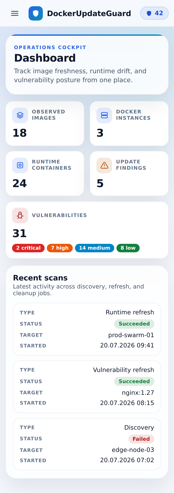
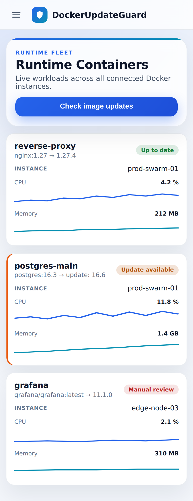
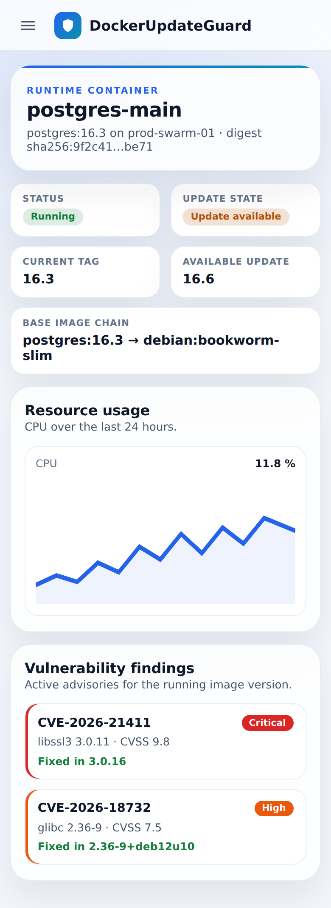
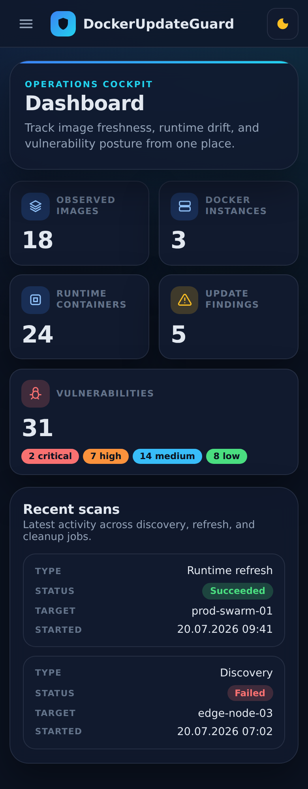
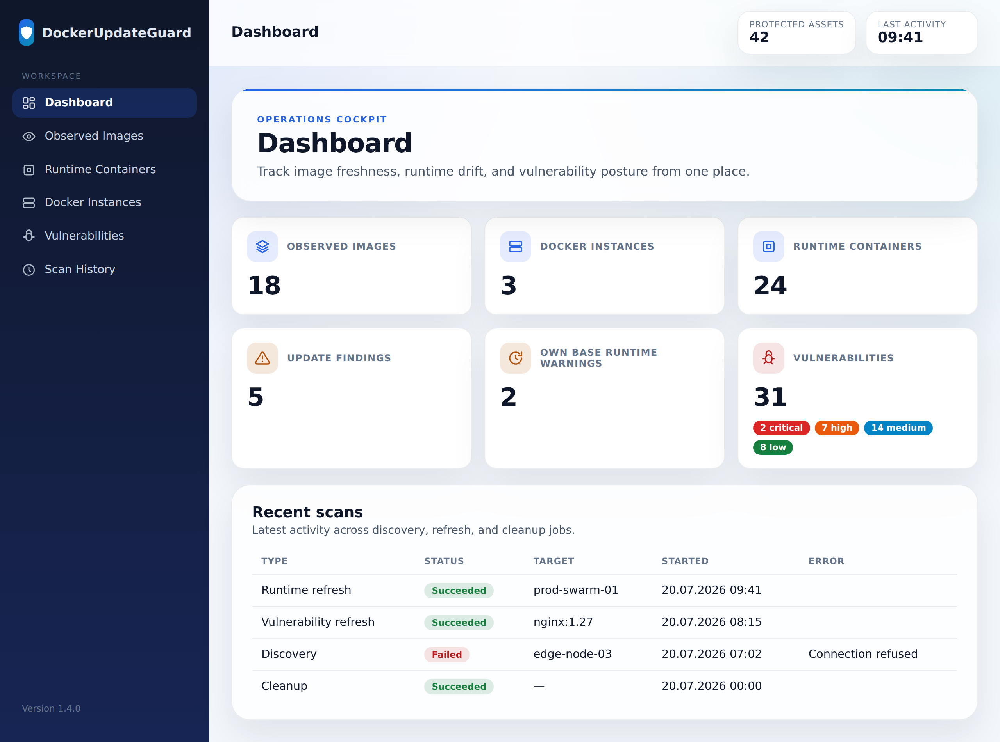
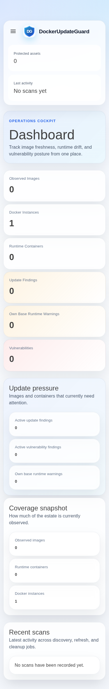

# Responsive UI Redesign — Concept

This document describes the concept for making the DockerUpdateGuard web UI
usable on tablets and smartphones, adding visual highlights, and smoothing the
loading experience. The current interface is built for the desktop; on narrow
viewports the top bar consumes ~200 px before any content appears, metric tiles
render one per row, data tables force horizontal scrolling, and pages flash a
blank "Loading…" state on every navigation.

The redesign keeps the existing technology stack — **Blazor Server + MudBlazor
9.7** — and is delivered entirely through a new CSS design-token layer, a few
markup adjustments, and small shared components. MudBlazor is **not** replaced.

> The mockups below are static HTML previews (see `mockups/`) rendered with the
> target design tokens. They illustrate the intended result; the actual
> implementation is split into the seven issues listed at the end.

## Design system

- **Design tokens** — a `:root` block of CSS custom properties (`--dug-*`) for
  brand, surface, text, status and severity colors, radii, shadows and spacing.
  All hardcoded hex values in `app.css` are refactored to consume them, which
  also makes dark mode a matter of overriding tokens under `.dug-dark`.
- **Typography** — the Inter variable font is self-hosted (no CDN, so the app
  can run air-gapped). Today `font-family: Inter` is declared but the font is
  never loaded, so it silently falls back to Segoe UI.
- **Breakpoints** — mobile-first, aligned with MudBlazor (`xs` < 600, `sm` ≥ 600,
  `md` ≥ 960, `lg` ≥ 1280). Canonical test widths: **390 / 768 / 1280 px**.
- **Visual highlights** — severity accent rails, tinted icon badges on metric
  cards, a gradient accent edge on hero panels, unified micro-interactions
  (hover lift, `:active` press, visible `:focus-visible`) with a
  `prefers-reduced-motion` opt-out, and an optional dark mode.
- **Smooth loading** — skeleton loaders that mirror the final layout replace the
  blank "Loading…" panels, and the `PersistentComponentState` pattern already
  used by the dashboard is extended to every page so prerendered content does
  not flash away when the interactive circuit connects.

## Concept previews

### Dashboard on a phone (390 px)

Compact one-row top bar with a status pill, two-up metric tiles with icon
badges, severity chips, and table rows rendered as cards.



### Runtime containers as cards (390 px)

Each table row becomes a bordered card with uppercase field labels, full-width
sparklines, a status badge, and a severity rail on rows that need attention.



### Container detail on a phone (390 px)

Two-up summary cards, a fluid-height chart, and vulnerability findings with
severity accent rails.



### Dark mode (390 px)

Same layout with the dark token overrides and a top-bar toggle.



### Dashboard on desktop (1280 px)

Three-up metric tiles and the full data table — the desktop layout is preserved.



## Current state (before)

Screenshots of the current UI captured at 390 / 768 / 1280 px (empty database)
are in [`before/`](before/). The phone dashboard below shows the core problems
the redesign addresses: the meta cards stack and consume the top of the screen,
and every tile is full-width.



## Per-page mobile strategy

| Surface | Phone (< 600 px) | Tablet (600–959 px) | Desktop (≥ 960 px) |
|---|---|---|---|
| Top bar | One row ≤ 64 px: hamburger + logo + status pill (popover for both metrics) | Row with two compact meta cards | Two full meta cards |
| List tables | Rows as bordered cards, uppercase labels | Card mode | Full table |
| Runtime sparklines | Full card width | ~7 rem | Current |
| Charts | 200 px | 240 px | 280 px |
| Dashboard tiles | Two-up (`xs=6`) | `sm=6` | `lg=4` |
| Detail summary cards | Two-up | Two-up | Current |
| Forms / filters | Full-width, stacked | Two-column | Current |

## Implementation issues

The work is split into seven dependency-ordered issues. Order:
**1 → (2, 3, 4) → 5 → (6, 7)**.

1. Responsive UI foundation: design tokens, self-hosted Inter font, dead-asset cleanup
2. Responsive app shell: compact one-row top bar on phones
3. Mobile card styling for all tables; remove fixed widths from the runtime containers table
4. Responsive chart heights and mobile grid reflow for dashboard and detail pages
5. Skeleton loaders and `PersistentComponentState` for all pages
6. Dark mode: `PaletteDark`, top-bar toggle, token overrides
7. Visual polish: metric-card icon badges, severity rails, hero accent, responsive forms

## Regenerating the images

Concept previews (static mockups):

```bash
cd docs/ui-concept
node screenshot-mockups.cjs
```

"Before" screenshots require the app running against a PostgreSQL database
(an empty database is sufficient — pages render their empty states):

```bash
# 1. PostgreSQL (Docker or a local cluster) with a database "dockerupdateguard"
# 2. Run the app:
cd src/DockerUpdateGuard
ConnectionStrings__DockerUpdateGuard="Host=localhost;Port=5432;Database=dockerupdateguard;Username=<user>;Password=<pw>" \
DockerUpdateGuard__DockerInstances__0__Name=local \
DockerUpdateGuard__DockerInstances__0__Enabled=false \
dotnet run -c Release
# 3. Point the base URL in screenshot-before.cjs at the app and run it.
```
